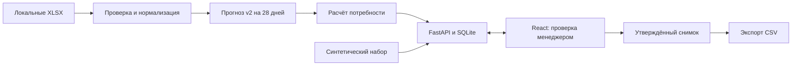

# Tirek — рекомендации по пополнению склада

Проект команды **Tirek Systems and Solutions** для HackAlem AI.
Кейс ТОО «Электрокомплект»: автоматический расчёт заказов поставщикам.

Tirek помогает закупщику перейти от ручного сведения Excel к списку закупок
с объяснением каждой позиции. Система учитывает прогноз продаж, остатки,
поступления и ограничения партии. Менеджер проверяет рекомендации, меняет
количество с указанием причины, утверждает снимок заказа и скачивает CSV.
Цель — уменьшить дефицит, излишки и время подготовки заказа; экономический
эффект в эксплуатации пока не измерен.

**Жюри:** [запуск](#быстрый-запуск) · [проверка за 5 минут](#проверка-за-5-минут)
· [метрики](#качество-прогноза) · [подробный сценарий](docs/jury-guide.md)
· [анализ соответствия условиям](docs/submission-analysis.md).

## Что можно проверить

- Обзор склада, поиск и группировку рекомендаций по поставщику, карточку товара,
  историю спроса, причины решения и отсутствующие данные.
- Полный демонстрационный цикл: корректировка → утверждение → экспорт →
  повторное скачивание сохранённого снимка.
- Импорт шести совместимых XLSX Systeme Electric, нормализацию, прогноз v2
  и расчёт потребности через встроенный адаптер API.
- Сохранённые веса, протокол временной проверки, сравнение с baseline
  и тесты бизнес-правил.

**Два режима проверки:** встроенное демо содержит 12 синтетических товаров
и работает без партнёрских файлов и API-ключей. Его числа подготовлены заранее,
`forecast.method=contract_example`. Реальный адаптер запускает сохранённую модель
на локальных XLSX; исходные данные партнёра в Git не включены.
Алгоритмы stockout и клиентских выбросов реализованы отдельно и пока не входят
в этот реальный HTTP-путь. [Границы реализации](docs/submission-analysis.md).

## Быстрый запуск

Нужны **Git, Python 3.12, Node.js 20.19+ и npm**. Команды выполняются из
корня проекта. Для первой установки зависимостей нужен интернет.
Docker, внешняя база, обучение модели и ключ LLM не требуются.

```sh
git clone https://github.com/BAITC-Hacks/hack-e1c6f154-tirek-systems-and-solutions.git
cd hack-e1c6f154-tirek-systems-and-solutions
```

### Windows / PowerShell

```powershell
py -3.12 -m venv .venv-ml
.\.venv-ml\Scripts\python.exe -m pip install -r backend/requirements-ml.txt
npm --prefix frontend ci
```

В первом терминале запустите API:

```powershell
.\.venv-ml\Scripts\python.exe -m uvicorn backend.app.main:app --host 127.0.0.1 --port 8000
```

Во втором терминале из того же корня:

```powershell
npm --prefix frontend run dev
```

Также доступен общий скрипт `./scripts/dev.ps1`: он запускает оба сервера,
проверяет доступность API через Vite и сохраняет логи в `.logs/`.
Если PowerShell запрещает выполнение скрипта, используйте две команды выше.

### Linux / macOS

```sh
python3.12 -m venv .venv-ml
.venv-ml/bin/python -m pip install -r backend/requirements-ml.txt
npm --prefix frontend ci
.venv-ml/bin/python -m uvicorn backend.app.main:app --host 127.0.0.1 --port 8000
```

Во втором терминале: `npm --prefix frontend run dev`.
Локальная проверка сдачи выполнялась на Windows.

| Адрес | Назначение |
| --- | --- |
| http://127.0.0.1:5173 | Приложение для жюри |
| http://127.0.0.1:8000/docs | Интерактивная документация API |
| http://127.0.0.1:8000/api/v1/health | Проверка работы API |

Первый запуск автоматически создаёт SQLite и демонстрационный набор.
Данные сохраняются в `data/`; другой каталог задаётся переменной `DATA_DIR`.
Остановка — `Ctrl+C` в каждом терминале. [Настройки](backend/README.md).

## Проверка за 5 минут

1. Откройте приложение. Если раньше использовались другие данные, нажмите
   **«Новый расчёт»**, выберите синтетический набор и стандартные параметры:
   28 дней = 7 дней поставки + 21 день пересмотра.
2. В **«Рекомендациях»** найдите `EZ9F34116` и откройте карточку:
   доступны история, прогноз, остаток, партия и обоснование.
3. В **«Корректировке»** введите `13` и причину: приложение должно
   отклонить количество, не кратное 12. Введите `156` и причину
   «Уточнён план монтажа», сохраните.
4. Отметьте позицию, нажмите **«Утвердить (1)»**, затем
   **«Утвердить и скачать CSV»**. Проверьте в файле `final_quantity=156`
   и причину. Заказ поставщику не отправляется.
5. В **«Истории решений»** повторно скачайте снимок. Найдите `A9R41240`
   в рекомендациях: неизвестный остаток показан как `—`, указана причина
   отсутствия количества.

[Полный сценарий, формат CSV и проверка реальных XLSX](docs/jury-guide.md).

## Технологии и архитектура

| Часть | Технологии и назначение |
| --- | --- |
| Интерфейс | React 19, TypeScript, Vite 7, React Router, Recharts, Radix Dialog |
| API и хранение | Python, FastAPI, Pydantic / JSON Schema, SQLite, фоновые задачи |
| Данные и прогноз | openpyxl, pandas, NumPy, SciPy, CatBoost; baseline и смеси моделей |
| Расчёт заказа | Python, дневные траектории, поступления, экономика, MOQ и кратность |
| Проверки | pytest, unittest, Playwright, OpenAPI 3.1 |



## Методология

1. Источники проверяются и получают SHA-256 и версию набора. Помесячные продажи
   и детализация сверяются, а не складываются. Неизвестные значения остаются `null`.
2. Прогноз v2 оценивает положительные наблюдаемые продажи на следующие 28 дней.
   Методы выбирались по трём временным validation-окнам; признаки используют
   только прошлое, финальные веса нельзя применять к более ранним датам.
3. Расчёт учитывает свободный запас, даты поступлений, обязательства, внешний
   прирост и экономический профиль либо явно заданную политику категории.
   Неизвестные ограничения партии требуют проверки, недостаточные данные
   блокируют окончательное количество. Бюджет проверяется при утверждении.
4. Отдельный модуль [регулярного спроса](model/regular_forecast/README.md)
   оценивает спрос по доступным дням и группирует крупные клиентские покупки
   в семидневные окна. Повторяемые покупки сохраняются, разовый избыток помечается
   и исключается из регулярной оценки без удаления исходных событий.
   Это эвристика; в реальной выгрузке нет точных интервалов stockout
   и клиентских ID для подтверждения её качества.

## Качество прогноза

Результаты сохранённой v2 на двух ретроспективных 28-дневных окнах:

| Поставщик / единица | WAPE v2 | MAE на товар × окно |
| --- | ---: | ---: |
| Systeme Electric / шт. | 33,92% | 212,00 |
| IEK / м | 56,64% | 257,26 |
| IEK / упаковки | 26,89% | 13,77 |
| IEK / шт. | 33,30% | 24,81 |

WAPE = `Σ|прогноз − продажи| / Σпродажи`; меньше — лучше.
Для SE baseline v1: **37,73%**, улучшение v2: **3,82 процентного пункта**
по неокруглённым значениям. Это ошибка объёма продаж, а не доля верных решений.
Последние два окна уже использовались при разработке v1 и **не являются новым
независимым тестом**. Цель WAPE ≤10% не достигнута. Разные единицы не суммируются.

[Полный отчёт](model/forecast_v2/REPORT.md) ·
[сохранённые метрики](model/forecast_v2/artifacts/evaluation.json) ·
[воспроизведение и веса](model/forecast_v2/README.md).

## Автоматические проверки

Из корня после установки зависимостей (Windows; на Linux/macOS замените
`.\.venv-ml\Scripts\python.exe` на `.venv-ml/bin/python`):

```powershell
.\.venv-ml\Scripts\python.exe scripts/validate_contract.py
.\.venv-ml\Scripts\python.exe -m pytest backend/tests model -q
npm --prefix frontend run build
```

При запущенных API и frontend, из каталога `frontend/`:

```sh
npx playwright install chromium --no-shell
npm run test:e2e
```

Playwright создаёт деморасчёты и утверждения в активной базе; для изоляции
перед запуском API задайте `DATA_DIR=./data/jury-check`.
Метрики прогноза и успешность функциональных тестов оценивают разные свойства.

## Ограничения и навигация

- Реальный веб-адаптер рассчитан на шесть файлов **SE, Алматы, штуки**.
  IEK оценён офлайн. Универсального импорта Excel нет.
- При неизвестном MOQ и неподтверждённом складском снимке количество
  предварительное; утверждение неполных условий блокируется сервером.
- В реальном адаптере используется одна дневная траектория; вероятностная
  гарантия уровня обслуживания не подтверждена.
- LLM не подключён; обоснования детерминированные. Реальной отправки поставщикам,
  живой интеграции с 1С и подтверждённого импорта в конкретную конфигурацию 1С нет.
- Прототип локальный, однопользовательский; авторизация и production deployment
  не реализованы. Партнёрские файлы, клиентские данные и секреты не публикуются.

| Где смотреть | Содержание |
| --- | --- |
| [Сценарий жюри](docs/jury-guide.md) | Проверки, XLSX и CSV |
| [Анализ сдачи](docs/submission-analysis.md) | Условия, готовность и оставшиеся задачи |
| [Аудит интеграции](docs/integration-audit.md) | Проверки платформы и технические ограничения |
| [Матрица кейса](docs/requirements-matrix.md) | Пять обязательных бизнес-требований |
| [Backend](backend/README.md), [frontend](frontend/README.md) | Запуск и устройство приложения |
| [ML-интеграция](docs/ml-integration.md) | Реальный адаптер и расширение |
| [Прогноз v2](model/forecast_v2/README.md) | Текущая модель; [v1](model/README.md) — предыдущий эксперимент |
| [Расчёт заказа](model/decision/README.md) | Математика и ограничения |
| [Синтетический testbed](model/testbed/RESULTS.md) | Отдельная среда и её результаты |
| [OpenAPI](contracts/openapi.yaml) | API-контракт и типы |
| [Спецификация](docs/product-spec.md), [дизайн](DESIGN.md) | Целевой продукт и интерфейс |

Планы в `docs/` описывают целевой объём. Фактическое состояние реализации
и границы доказательств приведены в README и анализе сдачи.
